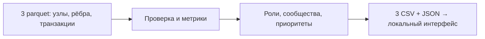

# Граф денег

**Рабочий стол AML-аналитика:** превращает выгрузку переводов в список участников для ручной проверки, объясняет структурные роли и показывает связи на графе. Известны 81 исходный клиент; вопрос аналитика — **кого из всей сети проверять первым и почему**. Роль и балл задают гипотезу для проверки, а не вероятность вины.

## Запуск для жюри

Нужны Python **3.12+ (кроме 3.14.1)** и Node.js **22.12+ с npm**. Интернет нужен при первой установке пакетов; расчёт и интерфейс работают локально, без внешнего API, GPU и учётной записи.

Организатор предоставляет файлы отдельно: положите `nodes.parquet`, `edges.parquet`, `transactions.parquet` в `FINANCE-CASE/data/`. Исходные parquet не публикуются в Git и не изменяются программой. Сдаваемые рассчитанные файлы находятся в `output/`.

**Одна команда из корня репозитория:**

```bash
python3 run.py
```

Она при необходимости создаёт `.venv` и устанавливает зависимости, собирает интерфейс, пересчитывает данные и запускает сервер. Для подготовленной машины доступно `python3 run.py --skip-install`; другой порт — `--port 8001`. Проверка без постоянного сервера — `python3 run.py --check` (сборка, расчёт и независимые валидаторы). Проверен запуск `python3 run.py --data <каталог исходных файлов> --check` из отдельной копии исходников без `.venv` и `node_modules`: установка, сборка и независимые проверки прошли за 16,5 секунды с кэшем пакетов. Это проверка нового окружения на текущей машине, не всех операционных систем; при первом скачивании время зависит от сети.

Откройте [http://127.0.0.1:8000](http://127.0.0.1:8000). Остановить сервер — `Ctrl+C`. Поиск принимает полный `gid` как строку: его цифры не преобразуются в JavaScript Number. Выбор узла показывает роль, признаки, ограничения данных и связи. Экспорты доступны в интерфейсе и напрямую по `/data/nodes_roles.csv`, `/data/clusters.csv`, `/data/top_nodes.csv`.

## Сценарий аналитика

1. Откройте топ из 50 узлов и прочитайте основание приоритета: оборот, число связей, пути от исходных клиентов (`seed`) и посредничество.
2. Вставьте **любой** полный `gid` в поиск; откройте карточку и направленные входящие/исходящие связи. Поиск охватывает всю сеть даже при активных фильтрах списка.
3. Фильтруйте роли, сообщества, `seed` и границу обхода. Смотрите временные признаки: исходящие переводы через 1–2 дня, синхронные поступления от разных плательщиков и пики активности. Совпадение календарных дат само по себе не доказывает движение тех же денег.
4. Прочитайте ограничения и предлагаемый запрос дополнительных данных в карточке; скачайте три CSV. Узлы на `depth=4` и изоляты сохраняются в поиске и результатах.

[Живое демо на пять минут](docs/DEMO.md) разбирает три конкретных узла.



## Технологии

Python, pandas и pyarrow читают и проверяют parquet; NetworkX рассчитывает графовые метрики и сообщества. React, TypeScript, Vite, Tailwind CSS и компоненты shadcn/ui дают интерфейс. Python-сервер публикует сборку и разрешённые файлы результата только по `127.0.0.1`. Между расчётом и UI — [версионированный контракт](docs/DATA-CONTRACT.md), без базы данных и облачной службы.

| Что нужно понять | Документ |
|---|---|
| Модули, поток данных, модель предметной области, HTTP и границы ответственности | [Архитектура](docs/ARCHITECTURE.md) |
| Схемы входа и выхода, типы, ссылки, единицы измерения, совместимость и ошибки | [Контракт данных](docs/DATA-CONTRACT.md) |
| Почему выбраны правила, как читать оценки и где метод ошибается | [Аналитическая модель](docs/METHODOLOGY.md) |
| Сценарий работы, смысл графа и правила интерфейса | [Дизайн интерфейса](DESIGN.md) |
| Живой прогон и разбор трёх узлов | [Пятиминутное демо](docs/DEMO.md) |

Программа использует графовые алгоритмы и детерминированные правила. Обученной ML-модели и LLM в текущей версии нет; `role_score` не является вероятностью.

## Что получено на реальных файлах

| Показатель | Значение |
|---|---:|
| Узлы / рёбра / транзакции | 2248 / 3119 / 4840 |
| Seed / изоляты | 81 / 19 |
| Сумма переводов | 365 890 012,01 KZT |
| Период | 01–31 июля 2026 |
| Слабосвязные компоненты, включая изоляты | 35 |
| Сообщества Louvain, включая одиночные | 91 |
| Строк в приоритетном списке | 50 |

Расширенный аналитический расчёт с маршрутами, устойчивостью и аномалиями на текущей машине занимает около **4 секунд**, меньше лимита 300 секунд. Три CSV побайтно совпали с базовой версией. Точные времена повторных запусков и детерминированность CSV/JSON проверяет `scripts/verify_delivery.py`.

В тексте кейса указаны 16 слабосвязных компонент. Прямой расчёт на всех 2248 узлах даёт 35: **16 компонент с рёбрами плюс 19 изолятов**. Изоляты сохранены, результаты не подгоняются под описание. Сообщества Louvain — иной объект, их количество не обязано совпадать с количеством компонент.

## Метрики, правила и пороги

[Подробная аналитическая модель](docs/METHODOLOGY.md) объясняет выбор метода, пересечение ролей, особые случаи и ограничения проверки качества.

Для направленного графа `i`/`o` — число разных входящих/исходящих контрагентов, `I`/`O` — суммы входящих/исходящих переводов. `p=O/I` определён только при `I>0` и `is_seed=false`; иначе `null`. `boundary_censored=true` при `depth>=4`. Число `s` — количество **других** seed, от которых существует направленный путь к узлу; сам seed не считается своим предком.

`b` — нормализованное посредничество (betweenness) на направленном **невзвешенном** графе: выборка `k=min(128,n)`, `seed=42`. Сумма перевода — сила связи, поэтому она не используется как длина кратчайшего пути.

Правила применяются сверху вниз: **первое совпадение выигрывает**. Это обеспечивает одну роль каждому узлу и делает конфликтующие признаки явными.

| Роль | Правило | `role_score` |
|---|---|---|
| coordinator | `s>=3`, `i>=3`, `o>=2`, `b>0` | `0.6+0.4*min(s/10,1)` |
| consolidator | `i>=3` и (`o<=2` или `i>=2*o`) | `0.5+0.5*min(i/10,1)` |
| distributor | `o>=5` и `o>=2*i` | `0.5+0.5*min(o/20,1)` |
| transit | не seed, не граница, `i>0`, `o>0`, `0.8<=p<=1.2` | `max(0.5,1-abs(1-p))` |
| terminal | не seed, не граница, `I>0`, `p<=0.2` | `0.5+0.5*(1-p/0.2)` |
| peripheral | ни одно правило не выполнено; в том числе изоляты | `0.2` |

`role_score` ограничен `[0,1]` и округлён до 6 знаков: это сила выполненного правила, не обученная или откалиброванная уверенность. `peripheral` означает недостаток структурных свидетельств, а не отсутствие риска. Координатор — гипотеза о структурном посреднике; она не доказывает реальное управление сетью. На границе допустима гипотеза консолидации по наблюдаемым входам, но нулевой выход не делает узел terminal.

**Приоритет проверки:**

```text
priority_score = 0.30*L(I+O) + 0.25*L(i+o) + 0.20*L(s) + 0.25*B
L(x) = log(1+x) / log(1+max(x))
B = b/max(b)
```

Максимумы берутся по всей наблюдаемой сети; при нулевом максимуме соответствующий вклад равен нулю. Итог округляется до 6 знаков; сортировка — по убыванию приоритета, при равенстве — по числовому `gid` по возрастанию. `top_nodes.csv` содержит первые 50 узлов (в меньшем наборе — все). Объяснение показывает оборот, связи, пути от seed и посредничество. Высокий приоритет означает полезность ручной проверки структуры, а не обвинение.

**Сообщества:** Louvain на неориентированной проекции, вес пары — сумма переводов в обе стороны, `resolution=1`, `seed=42`. Нулевые веса не участвуют в проекции; изоляты образуют отдельные сообщества. Номера сообществ задаются сортировкой по минимальному числовому `gid`. Внутренняя сумма учитывает каждое исходное направленное ребро внутри сообщества один раз; пять `top_gids` выбираются по приоритету и затем `gid`. При одинаковых входах и закреплённых версиях CSV побайтно воспроизводимы.

Гипотеза назначения сообщества опирается на количество consolidator/distributor/transit: сбор, распределение или транзит. Если лидирующий признак единственный либо встречается минимум вдвое чаще второго, выбирается его назначение; иначе указывается смешанный поток. Если все три счётчика нулевые, назначение не определяется. Объяснение содержит эти три числа и внутреннюю сумму, но не утверждает общий контроль участников.

## Временные признаки

Для каждого исходящего перевода считается совпадение с **хотя бы одним** наблюдаемым входящим переводом того же `gid` за **1 день** или за **1–2 дня** до него. Переводы в тот же день не входят в эти показатели: внутри дня порядок неизвестен. Каждый подходящий исходящий перевод учитывается один раз в каждом применимом счётчике; показатель «1–2 дня» накопительный и **включает** «1 день», поэтому их нельзя складывать.

«Синхронные поступления» показываются, когда за календарный день есть входящие как минимум от **трёх разных плательщиков**. Выбирается день с наибольшим числом таких плательщиков, при равенстве — более ранний. Пик активности показывается, если за день было не менее **трёх** входящих и исходящих транзакций вместе и их число не меньше удвоенного среднего `число всех наблюдаемых входящих и исходящих транзакций узла / число календарных дней периода`; перевод самому себе в дневном счётчике учитывается один раз. Профиль входящих отдельно показывает число активных дней, разных плательщиков, сумму и **медиану суммы одной входящей транзакции**.

Это признаки совпадения дат и нагрузки, а не доказательство происхождения средств. AI-ассистент отложен и в текущем продукте не реализован: объяснения и предложения запросить данные формируются проверяемыми правилами.

## Маршруты, устойчивость и аномалии

**Маршруты:** рассчитываются направленные A→B→C и возвратные циклы из 2–3 участников. По каждой связи доступны сумма и число переводов. Отдельно показаны строго возрастающие календарные даты и совпадения внутри дня с неизвестным порядком. Повторение — как минимум два различных дня начала строгой последовательности. Это не доказывает, что по цепочке двигались одни и те же деньги. На начальный узел публикуется до 20 маршрутов и 20 канонических циклов; перебор ограничен 2000 кандидатами на узел и 2000 комбинациями дат на маршрут. Ограниченные результаты явно помечены, поэтому отсутствие маршрута не доказывает его отсутствия в сети.

**Устойчивость:** из копии графа удаляются первые N участников исходного приоритета, N=0…20. Рассчитываются слабосвязные компоненты, изоляты, размер крупнейшей компоненты и её доля относительно оставшихся и исходных узлов. Исходная сеть не меняется; это структурный сценарий, а не прогноз поведения людей.

**Аномалии:** каждый узел сравнивается с другими узлами того же колена. Для входящих метрик исключаются seed, для исходящих — граница depth≥4. Нужны минимум 10 сопоставимых узлов. Сигнал: `(значение − медиана)/(1,4826×MAD) ≥ 3,5`. Если MAD=0, нужны минимум 20 соседей по группе, значение выше медианы и эмпирический ранг ≥95-го процентиля; при равенстве порядок определяет gid. Отдельно рассматривается доля наблюдаемых операций **5000≤сумма<10000 KZT**, перевод самому себе считается один раз. Операции ниже 5000 не видны, поэтому дробление не утверждается как факт. Все признаки содержат метрику, базу сравнения, правило и ограничения; исходные роли и приоритеты сохраняются.

На предоставленных данных опубликованы 3222 ограниченно выбранных маршрута, 218 циклов, 21 сценарий устойчивости и 1013 аномальных признаков у 650 узлов. Полный расчёт расширенного отчёта — около 4 секунд на текущей машине. Независимая проверка сверяет все опубликованные свидетельства с parquet; три обязательных CSV остались побайтно неизменными.

## Артефакты и контракт

| Файл | Точные колонки |
|---|---|
| `nodes_roles.csv` | `gid,role,role_score,cluster_id,priority_score,evidence` |
| `clusters.csv` | `cluster_id,n_nodes,n_seed,sum_kzt_internal,top_gids,hypothesis` |
| `top_nodes.csv` | `rank,gid,role,priority_score,why` |

`top_gids` в CSV разделены `;`. `evidence` и `why` содержат 1–200 символов. CSV записаны UTF-8, `gid` — целые десятичные цифры; при открытии в таблицах импортируйте колонку как **текст**, чтобы не потерять точность длинных идентификаторов. В `report.json` версии `1.0` все идентификаторы строковые, числовые поля конечные; `pass_through=null` — единственное предусмотренное отсутствие коэффициента. Детали: [контракт данных](docs/DATA-CONTRACT.md).

Пайплайн отклоняет дублирующиеся/неизвестные `gid`, неверные схемы и типы, пропуски и несогласованные суммы/числа транзакций. Суммы сравниваются с явным допуском **0,01 KZT**. При отсутствии файла CLI завершает работу с понятной ошибкой. Локальный HTTP-сервер слушает только `127.0.0.1`, публикует отдельно сборку и четыре разрешённых файла данных; проверяет traversal и выход через символьные ссылки. Это сервер для локального демо, без многопользовательской авторизации.

## Проверки

```bash
.venv/bin/python -m unittest discover -s tests -v
npm --prefix frontend test -- --run
npm --prefix frontend run build
.venv/bin/python scripts/verify_delivery.py --data FINANCE-CASE/data --out output
.venv/bin/python scripts/verify_extensions.py --data FINANCE-CASE/data --out output
```

Верификатор запускает два полных расчёта в разных каталогах, независимо сверяет все CSV/JSON с parquet, проверяет суммы и членство сообществ, ранги, граничные узлы, seed и изоляты, побайтную повторяемость CSV и JSON без времени исполнения, затем сравнивает опубликованные HTTP-файлы с диском. Unit-тесты дополнительно портят экспорты, проверяя, что валидатор действительно отклоняет нарушения.

Проверка браузера проводится отдельно от проверки данных; для автоматического сценария установите Chromium для Playwright и запустите:

```bash
cd frontend
npx playwright install chromium
cd ..
.venv/bin/python scripts/verify_delivery.py --data FINANCE-CASE/data --out output --browser
```

В ограниченной sandbox-среде тестам HTTP нужен доступ к loopback; ошибка `Operation not permitted` при создании сокета означает ограничение окружения, а не пройденную проверку. Не пропускайте её при приёмке.

## Ограничения интерпретации

Нет ground truth: качество ролей не измерено precision/recall, пороги выбраны как объяснимые эвристики. Доступны только внутрибанковские исходящие переводы июля 2026 от 5000 KZT, трассировка ограничена четырьмя коленами. Входы seed и переводы из-за пределов выборки неполны; `O>I` не означает ошибку баланса. У узла depth=4 невидимы дальнейшие исходящие: нулевой выход не доказывает удержание денег. Дробление ниже 5000 KZT, другие банки и другие месяцы не наблюдаются. Изоляты сохраняются даже без связей. Персональные сведения и внешнее обогащение не используются и не выдумываются.

## При росте до миллиона узлов

Нынешний NetworkX и полный JSON предназначены для предоставленного объёма. Для ~1 млн узлов потребуется потоковая/колоночная агрегация parquet по частям, компактные целочисленные индексы, CSR/CSC и компилируемые графовые операции. Посредничество останется выборочным с контролем времени и стабильности; достижимость seed — пакетной/битовой или ограниченной релевантной областью. Сообщества следует рассчитывать на разреженном графе, крупные компоненты обрабатывать отдельно. UI должен получать серверные окрестности, агрегированные сообщества и страницы ранжирования вместо полного JSON/графа. Это направление развития, не реализованное масштабирование текущего MVP.

[Схема решения](docs/ARCHITECTURE.md) · [Демо на пять минут](docs/DEMO.md)
