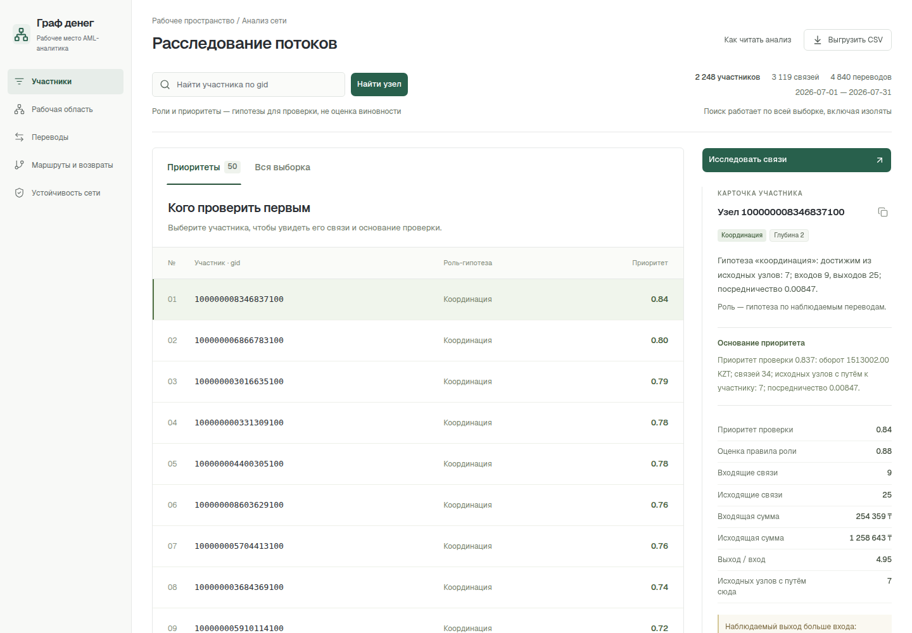

# Граф денег

Локальное рабочее место **AML-аналитика банка**: превращает обезличенную выгрузку переводов в объяснимую очередь проверки, показывает структуру сети и помогает исследовать движение денег.

Проблема: известны 81 исходный клиент, но сеть содержит 2248 узлов. Ручной просмотр связей затрудняет поиск точек консолидации, распределения и транзита. Проект отвечает на вопрос: **«Кого проверить первым, почему и какие связи это подтверждают?»**

Все роли и оценки — **гипотезы для ручной проверки**, а не утверждения о виновности. Основная аналитика работает локально без API-ключей; внешний AI подключается отдельно.

**Начать:** после установки Python и Node.js выполните `python3 run.py` из корня проекта. Исходные данные уже включены в `data/`. Полная инструкция — [установка и запуск](#установка-и-запуск), пример для жюри — [как проверить решение](#как-проверить-решение).

## Что реализовано

| Возможность | Что получает аналитик |
| --- | --- |
| Воспроизводимый расчёт | Один запуск от трёх parquet до трёх CSV и отчёта для интерфейса |
| Роли и приоритеты | Одна из шести ролей у каждого узла, оценки, объяснение и топ-50 для проверки |
| Сообщества | Louvain-кластеры с размером, числом исходных узлов, внутренним оборотом и гипотезой назначения |
| Интерфейс исследования | Полный поиск по gid, таблицы «Приоритеты» и «Вся выборка», фильтры ролей, кластеров, seed и границы |
| Направленный граф | Окрестность выбранного узла, роли, направление потоков; выбор ребра раскрывает точную сумму и число переводов |
| Карточка участника | Причины роли и приоритета, потоки, связи, исходные расчётные свидетельства и следующие запросы данных |
| Учёт обрыва выборки | Явные предупреждения для четвёртого колена и неполных входов seed; изоляты остаются в расчёте |
| Временные признаки | Исходящие через 1–2 дня после наблюдаемых входов, синхронные поступления и пики активности |
| Маршруты и возвраты | Ограниченный поиск A→B→C и циклов длиной 2–3 с датами, признаками повторения и оговорками |
| Аномальные профили | Сравнение с узлами того же колена и анализ наблюдаемых сумм около порога выгрузки |
| Устойчивость сети | Сценарии удаления первых N узлов приоритета, N=0…20, с изменением связности и числа изолятов |
| AI-ассистент, опционально | Вопросы о методике, приоритете узла и общих получателях; реальные вызовы LLM-инструментов и проверяемые ссылки |



## Как работает решение

1. Программа читает `data/nodes.parquet`, `data/edges.parquet`, `data/transactions.parquet` и проверяет схемы, идентификаторы, суммы и число операций.
2. Строит направленный граф со всеми узлами, включая изоляты; рассчитывает метрики, роли, сообщества, приоритеты и дополнительные признаки.
3. Сохраняет `nodes_roles.csv`, `clusters.csv`, `top_nodes.csv` и `report.json` в `output/`.
4. Аналитик открывает «Участники», выбирает строку и читает причину приоритета. Через «Исследовать связи» переходит к графу, выбирает стрелку и видит подтверждающую сумму.
5. Проверяет ограничения выборки и временные признаки в карточке, выбирает следующий запрос данных и скачивает результаты через «Выгрузить CSV».

Поиск по gid работает по всей сети, даже при активных фильтрах списка. На узком экране связи представлены отдельными списками входящих и исходящих.


## Технологии

| Компонент | Используемые технологии |
| --- | --- |
| Расчёт и проверка данных | Python, pandas, pyarrow, NumPy |
| Графовые алгоритмы | NetworkX: направленный граф, достижимость, посредничество, Louvain |
| Интерфейс | React, TypeScript, Vite, Tailwind CSS, shadcn/ui и Radix UI; SVG-граф |
| Локальный сервер | Стандартная библиотека Python, HTTP на 127.0.0.1 |
| Тестирование | unittest, независимые валидаторы parquet/CSV/JSON, Vitest, Testing Library, Playwright |
| Необязательный AI | OpenRouter API, маршрутизатор `openrouter/free`, разрешённые инструменты чтения отчёта |

Версии Python-зависимостей закреплены в [requirements.txt](requirements.txt), frontend — в [package-lock.json](frontend/package-lock.json). Обученная ML-модель для ролей не используется. `openrouter/free` — маршрутизатор бесплатных моделей, а не фиксированная собственная модель проекта.

## Архитектура проекта

Приложение разделено на пакетный расчёт и просмотр готового снимка. Выбор узла в браузере не запускает пересчёт. База данных и облачный кластер не нужны.

| Путь | Ответственность |
| --- | --- |
| `run.py` | Подготовка окружения, сборка UI, расчёт, проверка или запуск сервера |
| `data/` | Три исходных parquet организаторов, включённые в репозиторий |
| `solution/pipeline.py` | Валидация входа, последовательность расчёта, сериализация результатов |
| `solution/analytics.py` | Метрики графа, правила ролей, приоритеты, сообщества |
| `solution/temporal.py`, `routes.py`, `resilience.py`, `anomalies.py` | Временные свидетельства, маршруты, сценарии удаления и аномалии |
| `solution/server.py` | Раздача сборки и разрешённых результатов, локальный API ассистента |
| `solution/assistant.py` | Вызовы LLM, ограниченные инструменты и проверка фактов/ссылок |
| `frontend/src/` | Проверка JSON-контракта, таблицы, граф и карточки |
| `output/` | Три обязательных CSV и JSON-снимок для UI |
| `scripts/`, `tests/` | Независимые проверки результатов и регрессионные тесты |

В Python/CSV gid сохраняются как целые идентификаторы; в JSON и TypeScript — **строки**, чтобы длинные числа не теряли точность. Сервер слушает только loopback, не публикует корень репозитория и исходные parquet. Результаты и шрифты обслуживаются локально.

Подробнее: [архитектура](docs/ARCHITECTURE.md), [контракты данных и API](docs/DATA-CONTRACT.md), [устройство AI](docs/AI-ASSISTANT.md).

## Установка и запуск

### Требования

- Python **3.12+**, кроме **3.14.1**, с возможностью создания `venv` и установки пакетов через pip.
- Node.js **22.12+** с npm.
- Интернет при первой установке зависимостей. После подготовки расчёт и интерфейс работают без интернета; AI требует доступ к внешнему API.

### Запуск одной командой

1. Скачайте или клонируйте [репозиторий](https://github.com/BAITC-Hacks/hack-e66e0807-genz) и откройте терминал в его корне, где находится `run.py`.
2. Выполните:

   ```bash
   python3 run.py
   ```

3. Откройте [http://127.0.0.1:8000](http://127.0.0.1:8000). Остановка — `Ctrl+C` в терминале сервера.

Команда создаёт `.venv`, устанавливает необходимые зависимости, собирает frontend, пересчитывает `data/` и запускает приложение. Создавать `FINANCE-CASE` или переносить файлы **не нужно**. В Windows, если Python доступен как `python`, используйте `python run.py`; запуск на другой ОС отдельно не проверялся.

| Ситуация | Команда из корня |
| --- | --- |
| Пересчитать и проверить без постоянного сервера | `python3 run.py --check` |
| Использовать подготовленные зависимости без скачивания | `python3 run.py --skip-install` |
| Порт 8000 занят | `python3 run.py --port 8001` |
| Проверить другую выгрузку с теми же схемами | `python3 run.py --data /путь/к/каталогу --check` |

### Подключение AI — необязательно

Основная аналитика, граф и CSV **не требуют ключа**. Для ассистента:

1. Создайте собственный ключ на [OpenRouter](https://openrouter.ai/keys).
2. Скопируйте [.env.example](.env.example) в `.env` в корне и заполните `OPENROUTER_API_KEY` своим ключом.
3. Перезапустите `python3 run.py` и обновите страницу. Появится раздел «Ассистент».

`.env` исключён из Git. Ключ не передаётся браузеру. Чтобы явно отключить AI, задайте `ASSISTANT_ENABLED=0`. Платная модель не подставляется автоматически. Бесплатный провайдер имеет собственные ограничения доступности и запросов; отказ AI не мешает локальной работе.

## Как проверить решение

### Автоматическая проверка для жюри

Из корня репозитория:

```bash
python3 run.py --check
```

Ожидаемый результат: успешная сборка, расчёт и сообщения `PASS` независимых валидаторов. В `output/` должны находиться три CSV и `report.json`; ожидаемые значения для включённой выгрузки приведены ниже.

| Файл | Строк без заголовка | Колонки |
| --- | ---: | --- |
| `nodes_roles.csv` | 2248 | `gid,role,role_score,cluster_id,priority_score,evidence` |
| `clusters.csv` | 91 | `cluster_id,n_nodes,n_seed,sum_kzt_internal,top_gids,hypothesis` |
| `top_nodes.csv` | 50 | `rank,gid,role,priority_score,why` |

Проверки повторно рассчитывают результат и сверяют его с parquet: все gid, суммы, количество операций, роли и ограничения, сообщества, ранги, временные признаки, маршруты, устойчивость и аномалии. Детерминированность проверяется для CSV и JSON без времени исполнения; отдельно проверяется HTTP-раздача выгрузок.

### Повторяемый сценарий в интерфейсе

После `python3 run.py` откройте локальный адрес:

1. В «Участники → Приоритеты» выберите первую строку. Рядом должны быть основание приоритета и карточка; «Исследовать связи» открывает направленную схему.
2. Введите в поиск `100000008346837100`: ожидаются гипотеза **coordinator**, приоритет **0.837198** в данных (**0.84** в округлённом отображении интерфейса), 9 входящих и 25 исходящих связей. Выберите стрелку: рядом появятся отправитель, получатель, точная сумма и число переводов.
3. Найдите `100000003037476100`: глубина **4**, роль **consolidator**, вход **555 000 KZT**, нулевой наблюдаемый выход. Карточка должна предупреждать об обрыве; роль terminal не присваивается только из-за нулевого выхода.
4. Найдите `100000000456947100`: изолят, исходный узел, роль **peripheral**, приоритет **0**. Узел не потерян, отсутствие связей объяснено.
5. Раскройте «Временные признаки» и «Какие данные запросить дальше». Затем проверьте фильтры во «Всей выборке» и скачайте три результата через «Выгрузить CSV».
6. При подключённом AI задайте **«Как отбираются участники для приоритета?»**: ожидается объяснение формулы со ссылкой на реальный балл. Для выбранного узла также проверен вопрос **«Почему этот участник в приоритетах?»**.

Эти gid — примеры из включённых данных для демо, а не зашитые ответы алгоритма. Подробный [сценарий пятиминутного демо](docs/DEMO.md) содержит разбор трёх узлов; [отчёт верификации](docs/VALIDATION.md) фиксирует результаты и пределы проверки.

### Дополнительные тесты

После обычного запуска, который подготовит зависимости, на Linux/macOS:

```bash
.venv/bin/python -m unittest discover -s tests -v
npm --prefix frontend test -- --run
npm --prefix frontend run build
```

В Windows путь к интерпретатору окружения — `.venv\Scripts\python.exe`. Для независимой браузерной проверки при установленном Chromium:

```bash
cd frontend
npx playwright install chromium
cd ..
.venv/bin/python scripts/verify_delivery.py --data data --out output --browser
```

Живая проверка общего получателя пяти источников при настроенном AI:

```bash
.venv/bin/python scripts/verify_assistant_live.py
```

Зафиксировано: **45 Python-тестов**, **33 frontend-теста**, **24 основных и 9 дополнительных браузерных проверок** прошли. После переноса входов в корневой `data/` повторно прошли `python3 run.py --check`, обычный `python3 run.py` и 24 основных браузерных проверки. Последние измеренные полные CLI-прогоны — **4,181 и 4,227 секунды**, ниже 300 секунд. Это замеры на текущей машине, а не гарантия для любого оборудования. Чистая установка зависимостей проверялась с кэшем пакетов на той же машине.

## Данные и внешние сервисы

### Включённые данные

Источник — обезличенная синтетическая выгрузка организаторов кейса, предоставленная для хакатона. Исходные файлы находятся в `data/` и читаются без изменения.

| Файл | Строк | Поля |
| --- | ---: | --- |
| `nodes.parquet` | 2248 | `gid, depth, is_seed` |
| `edges.parquet` | 3119 | `src, dst, sum_kzt, n_tx, depth` |
| `transactions.parquet` | 4840 | `src, dst, date, sum_kzt` |

Период — **1–31 июля 2026**. Сумма наблюдаемых переводов — **365 890 012,01 KZT**. Сохранены **81 seed**, **19 изолятов**, рассчитаны **91 сообщество** и **35 слабосвязных компонент**. Указанные в кейсе 16 компонент соответствуют компонентам с рёбрами; с 19 изолятами общее число равно 35.

Исходные персональные атрибуты отсутствуют, внешнее обогащение не выполняется. Для CSV `top_gids` разделены `;`, текст evidence/why ограничен 200 символами. При открытии CSV в табличном редакторе импортируйте gid как **текст**, чтобы сохранить все цифры.

### Внешние зависимости и AI

При первой установке pip/npm загружают пакеты. Во время обычного анализа внешних запросов нет; ресурсы интерфейса и шрифты обслуживаются локально.

При включённом AI локальный сервер отправляет запрос на `https://openrouter.ai/api/v1/chat/completions` с моделью `openrouter/free`. Провайдер получает вопрос, выбранный gid и ограниченные свидетельства из отчёта. Полные parquet не передаются. Сервер разрешает только инструменты чтения, проверяет ссылки и значения, а фактический ответ формирует по проверенным данным. Для общего получателя сумма и число плательщиков заново считаются по полному набору соответствующих рёбер.

Проверены реальные запросы: общий получатель пяти источников (**179 500 KZT и пять ссылок на рёбра**), причина приоритета узла и методика ранжирования. Проверка методики также пройдена через браузер. Лимиты приложения: 4 раунда, 20 строк на инструмент, 16 КБ свидетельств, 20 секунд. Неизвестные или неподтверждённые ответы могут быть отклонены. [Промпт, инструменты, форматы API и ошибки](docs/AI-ASSISTANT.md) описаны отдельно.

## Критерии ролей и приоритетов

[Подробная аналитическая модель](docs/METHODOLOGY.md) объясняет выбор метода, пересечение ролей, особые случаи и ограничения проверки качества.

Для направленного графа `i`/`o` — число разных входящих/исходящих контрагентов, `I`/`O` — суммы входящих/исходящих переводов. `p=O/I` определён только при `I>0` и `is_seed=false`; иначе `null`. `boundary_censored=true` при `depth>=4`. Число `s` — количество **других** seed, от которых существует направленный путь к узлу; сам seed не считается своим предком.

`b` — нормализованное посредничество (betweenness) на направленном **невзвешенном** графе: выборка `k=min(128,n)`, `seed=42`. Сумма перевода — сила связи, поэтому она не используется как длина кратчайшего пути.

Правила применяются сверху вниз: **первое совпадение выигрывает**. Это обеспечивает одну роль каждому узлу и делает конфликтующие признаки явными.

| Роль | Правило | `role_score` |
|---|---|---|
| coordinator | `s>=3`, `i>=3`, `o>=2`, `b>0` | `0.6+0.4*min(s/10,1)` |
| consolidator | `i>=3` и (`o<=2` или `i>=2*o`) | `0.5+0.5*min(i/10,1)` |
| distributor | `o>=5` и `o>=2*i` | `0.5+0.5*min(o/20,1)` |
| transit | не seed, не граница, `i>0`, `o>0`, `0.8<=p<=1.2` | `max(0.5,1-abs(1-p))` |
| terminal | не seed, не граница, `I>0`, `p<=0.2` | `0.5+0.5*(1-p/0.2)` |
| peripheral | ни одно правило не выполнено; в том числе изоляты | `0.2` |

`role_score` ограничен `[0,1]` и округлён до 6 знаков: это сила выполненного правила, не обученная или откалиброванная уверенность. `peripheral` означает недостаток структурных свидетельств, а не отсутствие риска. Координатор — гипотеза о структурном посреднике; она не доказывает реальное управление сетью. На границе допустима гипотеза консолидации по наблюдаемым входам, но нулевой выход не делает узел terminal.

**Приоритет проверки:**

```text
priority_score = 0.30*L(I+O) + 0.25*L(i+o) + 0.20*L(s) + 0.25*B
L(x) = log(1+x) / log(1+max(x))
B = b/max(b)
```

Максимумы берутся по всей наблюдаемой сети; при нулевом максимуме соответствующий вклад равен нулю. Итог округляется до 6 знаков; сортировка — по убыванию приоритета, при равенстве — по числовому `gid` по возрастанию. `top_nodes.csv` содержит первые 50 узлов (в меньшем наборе — все). Объяснение показывает оборот, связи, пути от seed и посредничество. Высокий приоритет означает полезность ручной проверки структуры, а не обвинение.

**Сообщества:** Louvain на неориентированной проекции, вес пары — сумма переводов в обе стороны, `resolution=1`, `seed=42`. Нулевые веса не участвуют в проекции; изоляты образуют отдельные сообщества. Номера сообществ задаются сортировкой по минимальному числовому `gid`. Внутренняя сумма учитывает каждое исходное направленное ребро внутри сообщества один раз; пять `top_gids` выбираются по приоритету и затем `gid`. При одинаковых входах и закреплённых версиях CSV побайтно воспроизводимы.

Гипотеза назначения сообщества опирается на количество consolidator/distributor/transit: сбор, распределение или транзит. Если лидирующий признак единственный либо встречается минимум вдвое чаще второго, выбирается его назначение; иначе указывается смешанный поток. Если все три счётчика нулевые, назначение не определяется. Объяснение содержит эти три числа и внутреннюю сумму, но не утверждает общий контроль участников.


## Известные ограничения и масштабирование

- **Нет размеченных ролей:** accuracy, precision и recall не измерялись. Пороги — объяснимые эвристики, `role_score` не является вероятностью.
- **Неполный граф:** один банк, один месяц, только наблюдаемые исходящие переводы от 5000 KZT и обход до глубины 4. Входы seed неполны; `выход > вход` не описывает полный баланс. Отсутствие выхода на границе не доказывает удержание денег.
- **Время не связывает деньги:** признаки за 1–2 дня и совпадения внутри дня не доказывают происхождение средств. Внутридневной порядок неизвестен. Экран «Переводы» показывает агрегированные связи, не полный журнал отдельных банковских операций.
- **Поиск маршрутов ограничен:** до 20 путей и 20 циклов на начальный узел; до 2000 кандидатов на узел и 2000 комбинаций дат на маршрут. Усечение отмечено в отчёте. Отсутствие найденного маршрута не доказывает его отсутствия.
- **Аномалии не доказывают дробление:** операции ниже 5000 KZT невидимы. Сравнения выполняются внутри одного колена с исключением несопоставимых входов seed и выходов границы; правила и пороги описаны в [методике](docs/METHODOLOGY.md).
- **Устойчивость — условный сценарий:** удаляются первые N узлов существующего рейтинга; это не поиск оптимального набора и не прогноз поведения участников.
- **AI зависит от внешнего бесплатного провайдера:** нужен собственный ключ, возможны лимиты, таймауты и отказ неподтверждённому ответу. Успех трёх сценариев не гарантирует ответ на любой вопрос. Без AI обязательные функции доступны.
- **Локальный прототип:** нет многопользовательской авторизации, потоковой загрузки, реальных банковских интеграций и проверенного промышленного развёртывания. Другой физический компьютер и другая ОС отдельно не проверялись.

**Масштаб до ~1 млн узлов:** текущие NetworkX и полный JSON рассчитаны на объём кейса. Понадобятся чтение parquet по частям, компактные индексы и разреженные структуры графа, компилируемые операции, пакетная достижимость и контролируемое приближение посредничества. UI должен запрашивать ограниченные окрестности и страницы рейтинга вместо всего отчёта. Потребуются контроль доступа, наблюдаемость и атомарная смена снимков. Это описание необходимых изменений, а не заявление, что текущая версия уже проверена на миллионе узлов.

## Развёрнутая версия

**Публичная deployed-версия не опубликована в материалах проекта.** Подтверждённый способ работы — локальный запуск по адресу [http://127.0.0.1:8000](http://127.0.0.1:8000); это адрес на компьютере запустившего приложение, а не публичная ссылка.

[Репозиторий](https://github.com/BAITC-Hacks/hack-e66e0807-genz) · [Схема и архитектура](docs/ARCHITECTURE.md) · [Контракт](docs/DATA-CONTRACT.md) · [Методика](docs/METHODOLOGY.md) · [Демо на пять минут](docs/DEMO.md) · [Результаты проверки](docs/VALIDATION.md)
