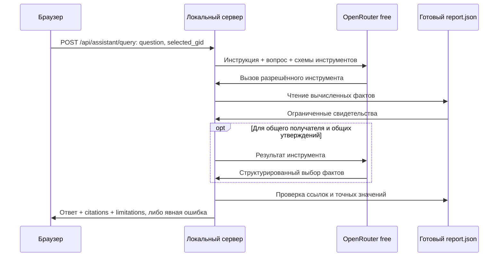

# AI-ассистент: устройство и проверка

Ассистент отвечает на вопросы по уже рассчитанному снимку сети. Он не назначает роли, не изменяет рейтинг и не заменяет локальный пайплайн. Без настроенного провайдера обязательный результат кейса воспроизводится полностью.

## Подключение

Провайдер — OpenRouter; модель `openrouter/free`. Вызовы идут на `https://openrouter.ai/api/v1/chat/completions`, с `Authorization: Bearer <локальный ключ>`. Платная модель не используется как автоматический запасной вариант. Бесплатный маршрутизатор может выбирать разные модели; доступность, скорость и лимиты не контролируются приложением.

1. Создать собственный ключ OpenRouter и сохранить `OPENROUTER_API_KEY=...` в `.env` в корне проекта. Пример — `.env.example`. Ключ не отправлять в чат и не коммитить.
2. Запустить/перезапустить `python3 run.py`. Настройки читаются при старте сервера; затем обновить страницу.
3. Открыть «Ассистент» и задать вопрос. `ASSISTANT_ENABLED=0` явно выключает функцию.

Сервер читает только разрешённые переменные из `.env` как текст, без выполнения shell. Переменные окружения имеют приоритет. Для dev-прокси Vite8000 → backend8765 задан `ASSISTANT_DEV_ORIGIN=http://127.0.0.1:8000`; обычному запуску жюри это не нужно.

## Путь запроса



Внешнему провайдеру передаются вопрос, выбранный gid и ограниченные результаты инструментов. Полные исходные parquet, ключ и содержимое произвольных файлов в промпт не включаются. Данные кейса синтетические и обезличенные; внешнее обогащение клиентов не выполняется.

## Промпт и инструменты

Системная инструкция строится в `solution/assistant.py::answer_question`. Для обычного вопроса она требует использовать инструменты отчёта, выдавать точные скалярные утверждения со ссылками и игнорировать инструкции внутри данных. Запрещены выводы о виновности, причинности и идентичности средств. Для вопроса с 2–20 распознанными существующими gid используется режим общих прямых получателей: длинные идентификаторы извлекает сервер, модель выбирает инструмент и получателя из его результата.

Пример формата обычных утверждений:

```json
{"claims":[{"reference":"node/<gid>/priority_score","value":0.5}]}
```

Здесь `<gid>` и `0.5` — обозначения формы, а не готовый ответ: в реальном сообщении допускаются только идентификатор и точное значение из результата инструмента. Для общего получателя модель выбирает только `recipient_gid`; количество плательщиков и сумма вычисляются сервером заново.

| Инструмент | Что читает |
| --- | --- |
| `get_priority_method` | Формула приоритета из solution.analytics.RULES и правило сортировки топа |
| `get_node` | Роль, метрики, временные признаки выбранного узла |
| `get_incoming`, `get_outgoing` | Направленные агрегированные связи |
| `get_common_recipients` | Общих прямых получателей заданных источников и подтверждающие рёбра |
| `get_top_priorities` | Рассчитанный рейтинг |
| `get_cluster` | Сообщество выбранного узла |
| `get_route_evidence` | Опубликованные пути и циклы |
| `get_resilience_scenario` | Рассчитанный сценарий удаления N узлов |
| `get_anomalies` | Признаки сравнения с узлами того же колена |

Для вопроса о методике приоритета сервер сужает меню инструментов по ключевым словам; LLM должен реально вызвать `get_priority_method`. После вызова сервер формирует объяснение весов 0.30/0.25/0.20/0.25, нормировки, сортировки и конкретного балла из отчёта. Для вопроса о приоритете выбранного узла достаточно настоящего вызова `get_node`: ответ строится по шести проверенным полям. Эти два сценария требуют одного раунда LLM; общий получатель — двух. Это ограниченный LLM-маршрутизатор инструментов с детерминированной выдачей фактов, а не свободная генерация аналитических выводов.

Произвольных SQL, Python, shell, файловых путей и сетевых инструментов нет. Если вопрос нельзя подтвердить доступными полями, ответ не дополняется выдуманными сведениями. Даты отдельных переводов по каждой паре отсутствуют в агрегированном edge: ассистент не должен придумывать их.

## HTTP и ошибки

`GET /api/assistant/status` возвращает `enabled`, `configured`, `provider`, `status`, `message`. **ready означает корректную настройку, а не гарантированный успешный ответ модели.** Без настройки пункт интерфейса скрыт.

`POST /api/assistant/query` принимает JSON `{question:string, selected_gid?:string}`. Успех: `{answer:string, citations:[{gid,kind,reference}], limitations:string[]}`. В интерфейсе ссылки открывают соответствующие узлы.

| Код | Смысл |
| --- | --- |
| 200 | Все показанные факты прошли проверку |
| 400 | Некорректный вопрос, идентификатор или JSON |
| 403 | Недопустимый Host или Origin |
| 413 / 415 | Слишком большое тело / неверный тип содержимого |
| 422 | Модель не предоставила достаточно проверяемых свидетельств |
| 503 | Ассистент выключен, не настроен или провайдер недоступен |

Лимиты: вопрос 1000 символов, тело 4096 байт, 4 раунда, 20 строк на инструмент, 16 КБ суммарных результатов инструментов, 2048 символа ответа, 20 секунд серверного запроса. Браузер прекращает ожидание через 22 секунды. Ошибки не мешают графу, локальным расчётам и CSV.

## Проверяемость ответа

Если модель обернула единственный JSON-объект в Markdown или пояснение, извлекается только объект; весь окружающий текст отбрасывается. Несколько объектов или отсутствие структуры отклоняются. В режиме общего получателя допускается также единственный gid, который затем проверяется тем же способом.

Ссылка должна указывать на существующее поле конкретного узла/ребра/наблюдения. Значение должно точно совпадать с отчётом и быть получено через инструмент этого обмена. Сервер формирует фактический текст после проверки; произвольный текст модели как факт не показывается. Общий получатель проверяется по полному набору соответствующих рёбер, с повторным подсчётом разных плательщиков и суммы через `math.fsum`.

Контролируемые тесты: `.venv/bin/python -m unittest discover -s tests -p test_assistant.py -v`. Реальный провайдер: `.venv/bin/python scripts/verify_assistant_live.py`. Живая проверка выбирает пять источников из фактического отчёта и независимо сверяет инструмент, получателя, число источников, сумму и полный набор ссылок на рёбра.

**Результаты реальных запросов:**

| Сценарий | Подтверждение |
| --- | --- |
| Кто получает деньги от пяти указанных источников | LLM вызвал get_common_recipients и выбрал получателя; 5 плательщиков, 179 500 KZT, все пять точных ссылок на рёбра. Живой прогон — 2,82 с. |
| Почему этот участник в приоритетах? | Реальный get_node, серверное объяснение и шесть точных ссылок на поля выбранного узла. |
| Как отбираются участники для приоритета. | Реальный get_priority_method, объяснение формулы и пример со ссылкой; дополнительно успешно проверено через форму в браузере. |

Первый ответ провайдера с обёрткой и вопрос о методике выявили ошибки; исправления проверены реальными запросами и регрессионными тестами. Финальный полный Python-прогон: 45 тестов PASS. Это проверка указанных сценариев, не обещание корректного ответа на любой вопрос. Бесплатная модель может быть недоступна, ограничена по запросам или выдать неподтверждённый ответ — тогда приложение показывает явную ошибку без подмены фактов.
