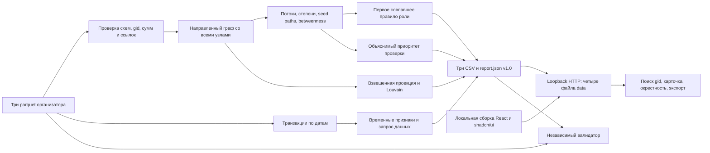

# Архитектура локального инструмента

Одна команда `python3 run.py` проверяет наличие входных файлов и инструментов, при необходимости подготавливает зависимости, собирает React-интерфейс, запускает пакетный расчёт и поднимает локальный сервер на `127.0.0.1:8000`. С флагом `--check` вместо постоянного сервера выполняются независимые валидаторы. Рабочий сценарий аналитика: начать с приоритетного списка, найти `gid`, проверить направленные связи и временные признаки, затем скачать CSV или запросить недостающую историю.

`solution.pipeline` отвечает за валидацию входа и сериализацию. `solution.analytics` рассчитывает метрики, роли, сообщества и приоритет. `solution.temporal` извлекает из транзакций календарные совпадения, профиль входящих и запросы для продолжения проверки. `solution.__main__` предоставляет пакетную команду. `solution.server` обслуживает собранный frontend и согласованный набор экспортов. Между аналитикой и UI нет базы, динамического API или внешней службы: граница — [версионированный контракт](DATA-CONTRACT.md).

`scripts/verify_delivery.py` не импортирует аналитические формулы: он заново читает parquet и проверяет целостность экспортов, агрегации и ранги. Два прогона измеряют воспроизводимость и полный CLI runtime. Тесты изменения экспортов и обхода файловых путей проверяют отказ при неверных данных.

Все узлы сохраняются до расчёта рёбер, поэтому изоляты не исчезают. В JSON `gid` всегда строковый; в Python он точный целочисленный. Времена исполнения исключены из сравнения повторяемости, остальные поля должны совпадать. Кратчайшие пути не интерпретируют большие суммы как большие расстояния. Граница depth=4 и неполнота seed явно передаются в карточки узлов.

Временные счётчики отражают только даты наблюдаемых переводов: «через 1–2 дня» включает «через 1 день», а совпадение даты не устанавливает внутридневный порядок или движение одних и тех же средств. Интерфейс загружает полный `report.json`, поэтому данный способ выдачи рассчитан на предоставленный объём, а не на миллион узлов.

Модель угроз ограничена локальным демо: HTTP-запрос не должен раскрывать файлы вне двух опубликованных корней; некорректные входы не должны незаметно породить правдоподобный отчёт. Сервер привязан к loopback, каталог данных имеет список из четырёх имён, пути декодируются и проверяются после разрешения символьных ссылок. Приложение не требует секретов. Исходные parquet остаются в игнорируемом каталоге организатора.
