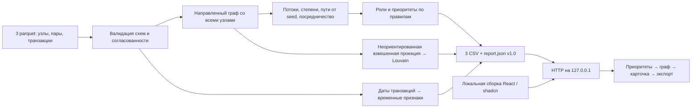

# Архитектура

«Граф денег» — локальное пакетное приложение. Аналитический процесс один раз строит проверенный снимок сети; браузер исследует этот снимок. Запрос выбора счёта не запускает пересчёт. База данных, облачный сервис и внешний API не требуются.

## Схема решения

Схема соответствует четырём этапам кейса: **данные → метрики → роли → интерфейс**. Подробные поля и правила совместимости описаны в [контракте](DATA-CONTRACT.md), смысл расчётов — в [аналитической модели](METHODOLOGY.md).

## Модель предметной области

| Сущность | Идентичность и связи | Значение |
|---|---|---|
| Участник | Уникальный `gid`; ровно одна роль и один `cluster_id` | Наблюдаемый счёт/клиент; персональных атрибутов нет |
| Агрегированная связь | Направленная пара `(src,dst)` | Сумма и число переводов за период; обратная пара — другая связь |
| Транзакция | Строка исходной таблицы с src, dst, date, sum_kzt | Основание для сверки агрегатов и временных наблюдений; уникальный банковский ID не предоставлен |
| Сообщество | `cluster_id`, участники, внутренний оборот, top_gids | Группа по структуре переводов; не доказательство общего контроля |
| Приоритет | Ранг участника и объяснение `why` | Очередность ручной проверки, не решение о виновности |
| Наблюдение | Метрики и предупреждения в карточке | Проверяемая гипотеза с ограничениями выборки |

`gid` остаётся точным целым в Python и строкой в JSON/TypeScript: 18-значный идентификатор нельзя безопасно хранить в JavaScript Number. Суммы используются как числовые значения KZT; это не банковский бухгалтерский движок. Согласованность агрегатов проверяется с допуском 0,01 KZT.

## Модули и ответственность

| Путь | Вход → результат | Ответственность |
|---|---|---|
| `run.py` | Файлы и установленные инструменты → работающее приложение | Подготовка .venv/npm, сборка, пересчёт, запуск сервера либо `--check` |
| `solution/pipeline.py` | Каталог parquet → dict и четыре выходных файла | Проверка входа, запуск аналитики, сериализация CSV/JSON |
| `solution/analytics.py` | Проверенные nodes/edges → узлы, сообщества, топ, DiGraph | Степени, суммы, достижимость, betweenness, Louvain, роли и ранги |
| `solution/temporal.py` | Узлы и transactions → дополненные карточки | Совпадения дат, профиль входа, синхронность, пики, запросы данных |
| `solution/__main__.py` | Аргументы CLI → запуск pipeline | Пакетная точка входа и понятный выход при ошибке |
| `solution/server.py` | Каталоги результата и сборки → HTTP | Раздача только разрешённых файлов на loopback |
| `frontend/src/contract.ts` | Неизвестный JSON → проверенный Report | Типы, проверка структуры, мягкий отказ необязательных полей |
| `frontend/src/App.tsx` | Report и выбранный gid → рабочее место | Поиск, приоритеты, фильтры, карточка и навигация |
| `frontend/src/components/Graph.tsx` | Узлы, связи и выбранный gid → направленная окрестность | Визуальное представление наблюдаемых переводов |
| `scripts/verify_delivery.py` | Исходные данные и экспорты → результат проверки | Независимая сверка целостности, повторяемости, времени, HTTP и браузерного сценария |
| `scripts/verify_temporal.py` | Исходные транзакции и отчёт → результат проверки | Независимый пересчёт временных признаков |

Версии Python-пакетов закреплены в `requirements.txt`; frontend фиксируется `package-lock.json`. Собранные JS, CSS и шрифты обслуживаются локально. Интернет требуется для первоначальной установки, а не для анализа и просмотра.

## Жизненный цикл расчёта

1. Проверить три таблицы: поля, типы, конечность чисел, уникальность узлов и пар, известные ссылки и даты.
2. Сгруппировать transactions по направленной паре и сверить с edges: набор пар, количество и сумму.
3. Добавить **все** узлы в DiGraph до добавления рёбер. Поэтому изоляты сохраняют роль и доступны поиску.
4. Рассчитать метрики и сообщества. Правила роли применить в фиксированном порядке, приоритет нормализовать по текущему снимку.
5. Добавить временные признаки и запросы недостающей истории, сохранив оговорки об обрыве и seed.
6. Проверить допустимость JSON-чисел и записать три CSV с фиксированными колонками и `report.json`.
7. Браузер получает снимок, проверяет контракт и управляет выделением/фильтрами в памяти.

Фиксированы random seed, порядок входных узлов/рёбер, нумерация сообществ и разрешение равных рангов. Повторные CSV должны совпадать побайтно; JSON сравнивается без `meta.elapsed_seconds`. Время в meta заканчивается до записи файлов; независимый валидатор дополнительно измеряет **полный процесс CLI**, включая старт Python и запись.

Запись файлов последовательная, не транзакционная: сбой диска может оставить неполный набор. Запуск сервера проверяет наличие всех четырёх файлов. Для текущего локального сценария расчёт завершается до открытия UI; для промышленного обновления потребуется атомарная смена каталога снимка.

## HTTP-контракт и обработка ошибок

| Адрес | Поведение |
|---|---|
| `/` | Собранный `index.html` |
| `/assets/...` | Локальные ресурсы внутри каталога сборки |
| `/data/report.json` | Полный аналитический снимок |
| `/data/nodes_roles.csv`, `/data/clusters.csv`, `/data/top_nodes.csv` | CSV с заголовком скачивания |
| Неизвестный файл | 404 |
| Попытка traversal или выход через symlink из опубликованного корня | 403 |

Сервер слушает `127.0.0.1`, не весь сетевой интерфейс. Он не публикует исходные parquet или корень репозитория; каталоги не перечисляются. Заголовки `no-cache` и `nosniff` добавляются к файлам. Авторизации и API изменения данных нет: это сервер локального анализа, не многопользовательский сервис.

Некорректный обязательный JSON вызывает состояние ошибки с повторной загрузкой. Некорректные необязательные временные признаки исключаются с предупреждением, базовый узел остаётся доступен. Текст отчёта выводится как текст React, без HTML-интерпретации.

## Проверка и масштабирование

Команды запуска и проверки находятся в [README](../README.md#проверки). Unit-тесты проверяют аналитические граничные случаи и повреждённые контракты; независимые валидаторы сверяют реальные исходные данные; браузерный сценарий проверяет рабочий путь. Читаемость графа дополнительно проверяется по реальным снимкам desktop/mobile согласно [DESIGN.md](../DESIGN.md).

В текущей реализации все таблицы, граф и JSON находятся в памяти. Построение достижимости запускается для каждого seed, betweenness использует до 128 стартовых узлов, а для каждого сообщества просматриваются рёбра при подсчёте внутренней суммы. Для 2248 узлов это допустимо; производительность на миллионе узлов не заявляется.

При росте нужны колоночная агрегация по частям, компактный разреженный граф, компилируемые графовые операции, пакетная достижимость и агрегация внутреннего оборота за один проход по рёбрам. UI должен запрашивать страницы рангов, сообщества и ограниченные окрестности вместо полного JSON. Нужны версионирование снимков, наблюдаемость, контроль доступа и атомарное обновление. Это план развития, а не реализованные возможности.
